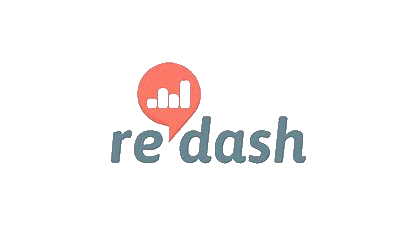

# Redash

An overview of Redash.

[](http://forthebadge.com) [](http://forthebadge.com)  [](http://forthebadge.com)  [](http://forthebadge.com) [](http://forthebadge.com)



## Getting started with Redash

* Clone this project
* Use docker-compose and the docker-compose.yaml file

```bat
docker-compose up -d
```

* Use docker-compose to stop properly the project

```bat
docker-compose down
```

## Useful links

* [Redash documentation](https://redash.io/help/user-guide/getting-started)

## Build with

* [Redash](https://redash.io/)
* [Docker](https://www.docker.com/) - Set of platform as a service (PaaS) products that use OS-level virtualization to deliver software in packages called containers
* [Git](https://git-scm.com) - Open source distributed version control system

## Contributing

If you would like to contribute, read the CONTRIBUTING.md file to learn how to do so.
